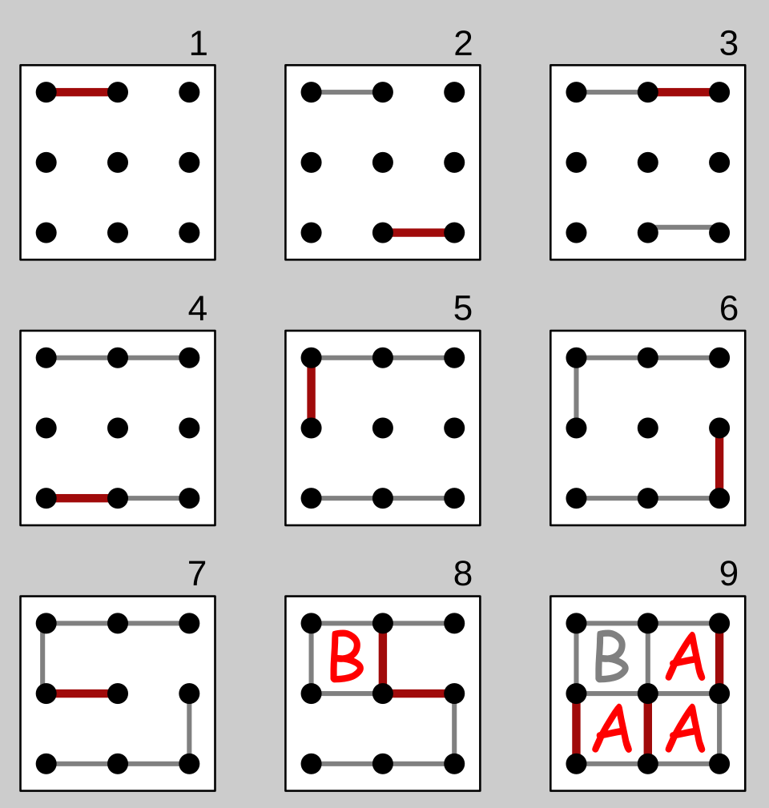

# Aufgabenblatt 1 - SoSe26

Prof. Dr. Jürgen te Vrugt, Peter Weßeler M.Sc.

Praktikum zum Modul Künstliche Intelligenz

## Ziele

-  Einarbeitung in python: In diesem Praktikum erarbeiten Sie Grundlagen und einige Besonderheiten der Programmiersprache python.

- Sie legen die Basis für die Erstellung von KI-Algorithmen im zweiten Praktikum. Dokumentieren Sie hierfür ihren Programmiercode und stellen Sie hierbei auch die verwendeten Konzepte entsprechend dar.

---

## Aufgabe P1 – Testaufgabe für den GitLab-Abtestat-Prozess
Erstellen Sie einen kleinen Beispielcode in Python, der für den Test des Abtestat-Prozesses verwendet werden kann.  
Dieser Beispielcode soll einige typische Python-Konzepte demonstrieren, die sich von Java und C unterscheiden können.

Ihr Python-Code soll insbesondere folgende Konzepte enthalten:

1. Dynamische Typisierung und Duck Typing  
   - Zeigen Sie, dass Funktionen mit unterschiedlichen Objekten arbeiten können, solange diese die benötigten Methoden/Attribute bereitstellen („If it walks like a duck and quacks like a duck, it’s a duck“).

2. Listen und List Comprehensions  
   - Verwenden Sie Listen als zentrale Datenstruktur.  
   - Nutzen Sie mindestens ein Beispiel mit einer List Comprehension (z.B. Erzeugen oder Filtern von Listen).

3. Funktionen als Objekte
   - Behandeln Sie Funktionen wie „First-Class Citizens“.  
   - Beispiel: Funktionen in Variablen speichern, als Parameter übergeben oder in Datenstrukturen ablegen.

4. Lambdas
   - Verwenden Sie mindestens eine anonyme Funktion (Lambda), z.B. als Argument für `map`, `filter`, `sorted` o. Ä.

> Hinweis:
Diese Aufgabe hat **rein technischen Charakter** und dient nur dazu, den GitLab-Abtestat-Prozess (Commit, Push, Merge Request etc.) zu erproben.  
Die Umsetzung der Python-Konzepte wird **nicht inhaltlich bewertet** und fließt **nicht** in die Bewertung des Abtestats ein.

------

## Aufgabe P2 – Dots And Boxes

Repository-URL: <https://git.fh-muenster.de/labki-lehre-studierende/26sose/ki-praktikum>

In dieser Aufgabe sollen Sie sich mit dem vorhandenen Quellcode auseinandersetzen und fehlende Spielelogik implementieren. Folgen Sie den unten stehenden Schritten, um die Implementierung abzuschließen.

 
*Figure 1: DotsAndBoxes Spielverlauf*  
Quelle: <https://en.wikipedia.org/wiki/Dots_and_boxes>

1. Repository-Initialisierung: \
Klonen Sie das angegebene Repository und öffnen Sie das Projekt in Ihrer bevorzugten Entwicklungsumgebung. Der Quellcode liegt in `src/` 

2. Quellcode-Analyse:  
Verstehen Sie den Aufbau und die Funktionsweise des vorhandenen Codes.

    - Durchsuchen Sie den Quellcode und identifizieren Sie zentrale Klassen und Methoden.  
    - Kommentieren Sie relevante Stellen, um die Funktionalität und ihre Bedeutung im Spielkontext zu beschreiben.

> **Hinweis:**
> - Kommentieren Sie jede Klasse mit ihrer Hauptaufgabe (z.B. Verwaltung der Spielsteuerung, Darstellung der Spiellogik, Umschreibung des Codes ist nicht erforderlich).
> - Kommentieren Sie komplexe oder zentrale Funktionen/Methoden.
> - Erläutern Sie die Hauptdatenstrukturen (z.B. wie ist das Spielfeld modelliert ist?).

3. Implementierung der fehlenden Spiellogik:  
Vervollständigen Sie die Spiellogik, sodass der Spielverlauf aus Abbildung 1 korrekt abgebildet wird.

    - Identifizieren Sie Methoden, die noch unvollständig oder nicht implementiert sind.  
    - Ergänzen Sie die notwendigen logischen Operationen für einen vollständigen Spielablauf.  
    - Implementieren Sie die Methode zur Überprüfung, ob das Spiel beendet ist (z. B. durch Sieg oder Unentschieden).  
    - Ergänzen Sie die Kontrolle, ob nach Auswahl einer Kante eine Box gebildet wurde.  
    - Validieren Sie Benutzereingaben und stellen Sie sicher, dass nur gültige Aktionen ausgeführt werden können.

> **Hinweis:**
> - Arbeiten Sie testgetrieben, indem Sie kleine Testfälle für Ihre Implementierung schreiben.
> - Stellen Sie sicher, dass Ihre Ergänzungen robust gegenüber fehlerhaften Eingaben sind.

4. Dokumentation und Abgabe:  
Stellen Sie sicher, dass Ihre Änderungen in kleinen Commits dokumentiert sind und von Dritten nachvollzogen werden können.

    - Verfassen Sie eine kurze Übersicht Ihrer Änderungen und Verbesserungen in einer `CHANGELOG.md`-Datei innerhalb Ihres Repositorys.
---

> **Hinweis:** Diese Aufgabe dient der Vorbereitung des nächsten Aufgabenblatts, dort werden wir einen menschlichen Spieler durch einen KI-Agenten ersetzen. Berücksichtigen Sie diese Zielsetzung durch eine geeignete Code-Struktur.

---

## Aufgabe P3 – Zufallsbasierter Non-Player-Character

Entwickeln Sie im Kontext der vorherigen Aufgabe einen Non-Player-Character (NPC), der zufällige erlaubte Spielzüge vornimmt und anstelle eines beliebigen menschlichen Spielers antreten kann.

Stellen Sie sicher, dass Sie problemlos zwischen einem menschlichen Mitspieler oder zufälligen NPC-Spieler wechseln können, sowohl für Spieler A als auch für Spieler B.

> Hinweis:
> Alle Arten von Spielern (menschlich, random, weitere NPC's ) sollen die gleiche Struktur besitzen. Nutzen Sie die Möglichkeiten von Objektorientiertheit.

